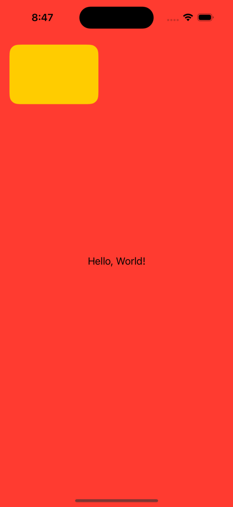

# SwiftUIPiP


A small package that provides a pip modifier for SwiftUI

The pip view can be moved by the user to all four corners and can be resized to three different sizes

## Usage

```swift
VStack {
    Text("Hello, World!")
}
.frame(minWidth: 0,
       maxWidth: .infinity, 
       minHeight: 0, 
       maxHeight: .infinity)
.background(Color.red)
.pip {
    Color.yellow
        .clipShape(RoundedRectangle(cornerRadius: 15.0))
}
```

## Output


